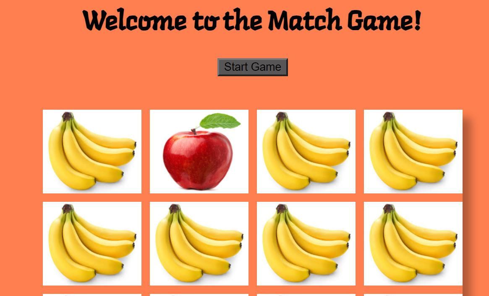
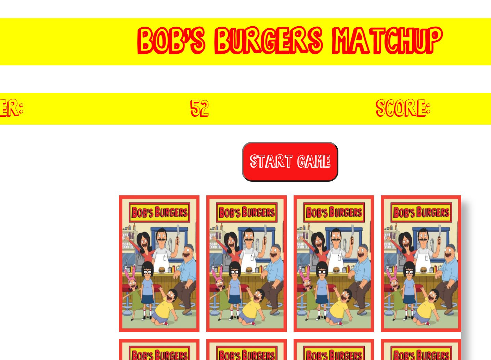

# Project 1 Global Feedback

### Pointers - Github

  - Don't add superfluous files; use `.gitignore`
    - examples: `.DS_Store`, `.vscode/`
  - Don't add API keys
    - remove repo if in previous commits
  - Project / Repo naming:
    - Stay away from `GAProjectOne`
    - Good Examples: `Respiru`, `Trivia-Night`
    - Sometimes acronyms, abbreviations work, e.g. `npm`, `npx`
  - Experiment with Markdown formatting
    - nice examples: [Joachim's](https://github.com/CLNEulalia/GA-SEI-Project-One), any SEI lesson
  - Prominent Display of link to Deployed Site
  - Keep the root clean, put assets in a folder
  - Things that were hard => Real Learnings
  - Make master and main branches line-up
  - To show code use code formatting, not a picture
  - Use of gif's in readme
    - to convey complex / hard to describe situation
    

### Pointers - HTML

 - Tab Name, use `<title>`
 - Favicon
 - Replace `Div`s with descriptive and semantic elements
   - [7 alternatives to divs](https://medium.com/@zac_heisey/7-alternatives-to-the-div-html-tag-7c888c7b5036)

### Pointers - JS

  - Keep console log clean
    - global variable or function parameter to control logging: "verbosity"
    ```javascript
    // bLog = true;
    bLog = false;
      ...
    if (bLog) console.log(playedId);
      ...
    function complexRule(player, board, winCondition, log=false) {...}
    ```
  - Concise, generic naming of variables and functions
    - `letTheGamesBegin()` => `startGame()`
    - useful for api design:
    > There are only two hard things in Computer Science: cache invalidation and naming things.
    >   [-- Phil Karlton](https://martinfowler.com/bliki/TwoHardThings.html)
    
  - DRY: all event handlers assigned for one type of component assigned in one function

  - "self documenting code": less comments, and more concise as time moves on

   
### Workflow & Project Planning

 - Acheive MVP quickly; chart your own individualized learning agenda
 - "Make it work, make it ~~fast~~ concise, make it pretty"
 #### make it work
 
 #### make it pretty
 
 
  
    